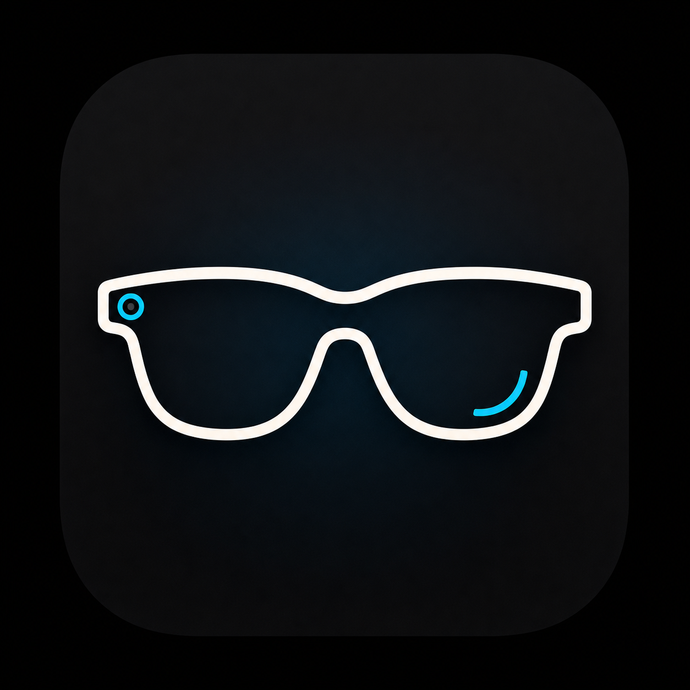
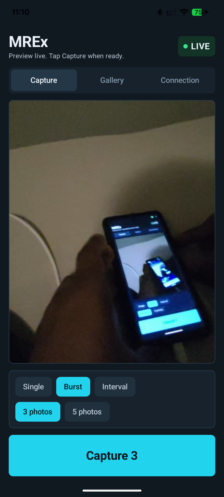
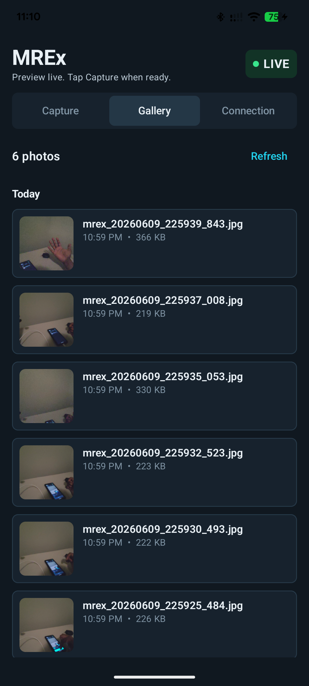
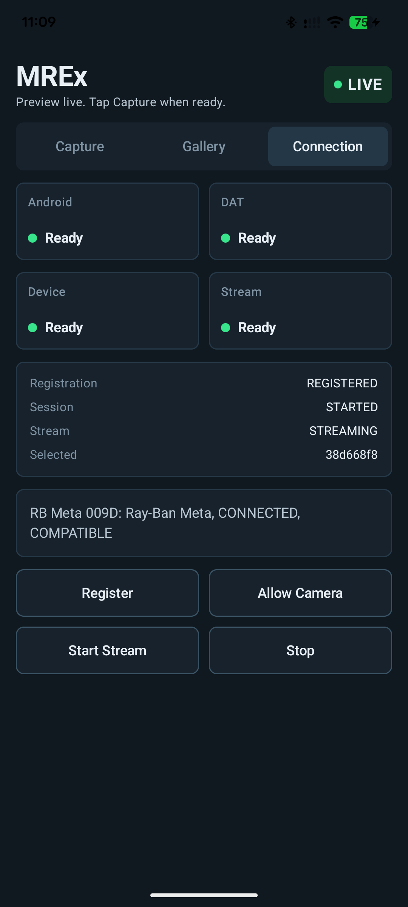

# MREx



Meta Ray-Ban Extension: an Android companion app for Ray-Ban Meta / Meta AI glasses. The app turns the phone into a structured control surface for remote capture, saved-photo review, and connection diagnostics.

This helps with hands-free selfies and shots where pressing the glasses capture button would move the frame.

## UI Preview

<p>
  
  
  
</p>

## What It Does

1. Connects to paired Ray-Ban Meta glasses through Meta's Wearables Device Access Toolkit.
2. Registers the app with Meta AI in Developer Mode.
3. Starts a glasses camera stream session.
4. Captures single, burst, or interval photos from the phone.
5. Saves JPEGs to Android Photos through MediaStore.
6. Shows captured MREx photos in an in-app gallery grouped by date.
7. Shows a connection dashboard for registration, device, session, and stream state.

Saved photos go here:

```text
Pictures/MREx
```

## Requirements

- Android phone. Tested on Pixel 7a.
- Ray-Ban Meta glasses paired and connected in the Meta AI app.
- Meta AI Developer Mode enabled.
- Android debugging enabled for installing from source with `adb`.
- GitHub personal access token with `read:packages` so Gradle can download Meta DAT artifacts from GitHub Packages.

## Setup

Create your local Gradle secrets file:

```bash
cp local.properties.example local.properties
```

Edit `local.properties` and set your GitHub package token:

```properties
github_token=YOUR_TOKEN_HERE
```

`local.properties` is ignored by Git and must not be committed.

## Build And Install

From the project root:

```bash
./gradlew :app:assembleDebug
adb install -r app/build/outputs/apk/debug/app-debug.apk
```

If Android prompts for USB debugging or install permission, allow it.

## Run Workflow

1. Open **MREx** on the phone.
2. Grant Android Bluetooth and camera permissions.
3. Tap **Register**.
4. Complete the Meta AI registration screen.
5. Return to the app.
6. Tap **Allow Camera** to grant glasses camera permission.
7. Tap **Start Preview**.
8. Wait for `Stream: STREAMING`.
9. Pick a capture mode:
   - **Single** captures one photo.
   - **Burst** captures 3 or 5 photos sequentially.
   - **Interval** keeps taking photos every 5, 10, or 30 seconds until stopped.
10. Tap the large shutter button.
11. Open the **Gallery** tab or check `Pictures/MREx`.

## Tools And Stack

- Android app written in Kotlin.
- Jetpack Compose and Material 3 for the UI.
- Gradle Kotlin DSL for builds.
- Meta Wearables Device Access Toolkit:
  - `mwdat-core`
  - `mwdat-camera`
- Android MediaStore for saving photos.
- AndroidX ExifInterface for orientation correction.
- `adb` for local debug installation.

## Project Layout

```text
app/src/main/java/com/apurv/metaremotecapture/
  MainActivity.kt        App lifecycle, DAT registration, sessions, capture modes, and gallery loading
  camera/               Preview frame conversion helpers
  model/                UI state, capture mode, app section, and gallery models
  ui/                   Compose screens and controls
```

## Current State

- Single, burst, and interval remote capture work after the DAT stream is running.
- The gallery lists MREx photos by date from `Pictures/MREx`.
- The connection dashboard shows Android, DAT, device, session, and stream state.
- The capture path is verified on Pixel 7a with Ray-Ban Meta glasses.
- The app uses `APPLICATION_ID=0`, which is for Meta AI Developer Mode testing.

## Privacy And Repository Safety

- No real GitHub token is committed.
- `local.properties` is ignored and stays on your machine.
- Build output, APKs, Gradle caches, and IDE files are ignored.
- The committed `local.properties.example` contains only placeholders.

## Troubleshooting

- If registration opens Meta AI and fails, confirm Meta AI Developer Mode is enabled.
- If no device appears, confirm the glasses are connected in Meta AI first.
- If capture says preview must be started, tap **Start Preview** and wait for `Stream: STREAMING`.
- If Gradle cannot download DAT packages, confirm `github_token` exists in `local.properties` and has `read:packages`.

## Distribution

This project is configured for local Developer Mode testing. For non-developer distribution, create an app in Meta Wearables Developer Center and replace the developer-mode application ID/client token values in the Android config.
